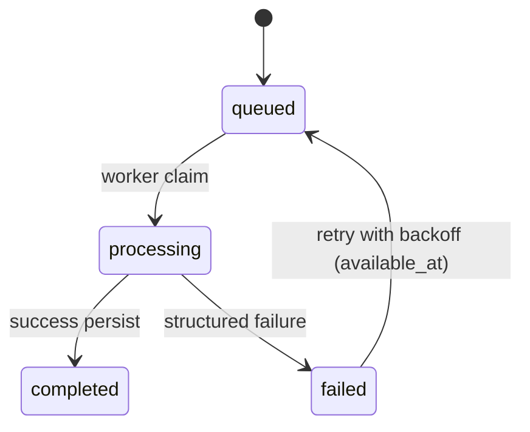

# Invariance Research — Full Implementation Dossier Source

## 1) Executive overview

`invariance_research` is a Next.js 15 + TypeScript SaaS platform for quantitative strategy validation. The repository now contains both:

1. A public-facing authority site (research/methodology/pricing/contact).
2. An authenticated application shell that accepts artifacts, runs queue-backed analysis, renders diagnostics, enforces plan entitlements, supports Stripe billing, and exposes an internal admin/ops console.

The current architecture is **service- and repository-driven** on the server side, with durable persistence in SQLite (`node:sqlite`) and a local object-storage abstraction for uploads/exports. Analysis and export work execute asynchronously via DB-backed queues and worker loops (embedded or split-process runtime).

---

## 2) Original product vision and intended outcome

### Vision from implemented public/product artifacts

The intended product outcome is visible in:

- Marketing narrative and authority routes (`/`, `/research-standards`, `/strategy-validation`, `/robustness-lab`, `/research`, `/methodology`, `/pricing`).
- Product shell framing as a "Strategy Robustness Lab" with domain diagnostics (overview, distribution, Monte Carlo, stability, execution, regimes, ruin, report).
- Emphasis on **execution-aware robustness validation**, not generic dashboard metrics.

The target state is a production-oriented validation platform where:

- Users upload trade/bundle artifacts.
- System classifies artifact richness and eligibility.
- Queue workers invoke `bt` (`bulletproof_bt` distribution) through a seam.
- Adapter normalizes engine payloads into a stable `AnalysisRecord` contract.
- Plan entitlements gate upload classes, diagnostics, and export capabilities.
- Admin/ops tooling provides bounded, safe operational controls.

---

## 3) Full phase-by-phase implementation history (Phase 1 → Phase 8)

## Phase 1 — Design system foundation

### Intended goal
Create a reusable institutional UI language and primitives before feature-specific product wiring.

### Implemented
- Tokenized design system (CSS vars + TS tokens + Tailwind extensions).
- Reusable primitives (`Button`, `Card`, `Alert`, `SectionHeader`) and domain shells (`ChartCard`, `MetricCard`, `InsightPanel`, `UploadPanel`).
- Baseline layout components (`Navbar`, `Footer`).

### Key files/modules
- `src/app/globals.css`
- `tailwind.config.ts`
- `src/lib/design/*`
- `src/components/ui/*`, `src/components/charts/*`, `src/components/layout/*`
- `docs/design-system.md`

### Architectural impact
- Established tokenized visual contract reused by public site and app shell.
- Reduced need for one-off component styling in later phases.

### Dependencies/contracts introduced
- Visual tokens as implicit cross-component contract.

### Limitations after phase
- No live backend workflows.
- UI shells were mostly static.

### Enabled next phase
- Rapid construction of public site pages using shared primitives.

---

## Phase 2 — Public site and conversion architecture

### Intended goal
Build credibility and conversion pathways around methodology/research storytelling.

### Implemented
- Public route suite and content-driven sections.
- Reusable `src/components/public/*` shell and sections.
- Navigation/content model in `src/content/site.ts`.

### Key files/modules
- `src/app/page.tsx` and public route pages under `src/app/*` (non-`/app` shell).
- `src/components/public/*`, `src/components/marketing/*`
- `src/content/site.ts`

### Architectural impact
- Introduced split between public experience and future authenticated product shell.

### Dependencies/contracts introduced
- Content structs (`primaryNav`, `footerGroups`, featured research blocks).

### Limitations after phase
- No authenticated analysis lifecycle.

### Enabled next phase
- Clear top-of-funnel to authenticated product entry.

---

## Phase 3 — Authenticated product shell

### Intended goal
Ship the structure of the Strategy Robustness Lab before full backend compute wiring.

### Implemented
- `/app` route group with workspace layout.
- Analysis detail route structure (`overview`, `distribution`, `monte-carlo`, `stability`, `execution`, `regimes`, `ruin`, `report`).
- App shell components (`AppShellLayout`, sidebar/topbar, insight rail).
- Mock analysis contracts and placeholder diagnostics for UI continuity.

### Key files/modules
- `src/app/app/layout.tsx`, `src/app/app/page.tsx`
- `src/app/app/new-analysis/page.tsx`, `src/app/app/analyses/*`
- `src/components/app-shell/*`
- `src/components/dashboard/*`
- `src/lib/mock/analysis.ts`
- `docs/product-shell.md`

### Architectural impact
- Locked route-level UX contract early.
- Created stable page/component APIs to later bind to real backend payloads.

### Dependencies/contracts introduced
- Mock analysis shape influenced stable `AnalysisRecord` contract direction.

### Limitations after phase
- No durable ingestion/queue/engine/entitlement processing.

### Enabled next phase
- Straightforward replacement of mocks with ingestion + API wiring.

---

## Phase 4 — Upload and engine seam integration

### Intended goal
Implement artifact intake, validation, eligibility classification, and engine seam boundary.

### Implemented
- Upload inspection endpoint and service.
- Ingestion system:
  - validators (file/trade-csv/bundle/semantic)
  - parsers (`generic_trade_csv`, `generic_bundle_v1`)
  - alias mapping, richness classification, eligibility matrix.
- Artifact persistence + storage write.
- Engine seam:
  - dynamic `bt` import (`bulletproof_bt` runtime namespace)
  - seam check for `run_analysis_from_parsed_artifact`.
- Analysis creation APIs and initial status lifecycle.

### Key files/modules
- `src/app/api/uploads/inspect/route.ts`
- `src/lib/server/services/upload-intake-service.ts`
- `src/lib/server/ingestion/**`
- `docs/ingestion-spec.md`
- `src/lib/server/engine/bulletproof-client.ts`
- `src/lib/server/engine/bulletproof-runner.ts`
- `docs/phase4-upload-workflow.md`, `docs/phase4-engine-integration.md`

### Architectural impact
- Introduced backend-owned artifact truth and eligibility semantics.
- Established adapter boundary between raw engine output and product contracts.

### Dependencies/contracts introduced
- `UploadInspectionResponse`, `ParsedArtifact`, eligibility contract.

### Limitations after phase
- Transitional persistence and lifecycle maturity gaps (addressed in phase 7+).

### Enabled next phase
- Live diagnostic mapping from engine to product-facing analysis payloads.

---

## Phase 5 — Live diagnostics and report mapping

### Intended goal
Replace placeholders with real engine-backed diagnostics while preserving stable UI contracts.

### Implemented
- Rich adapter mapping from `EngineAnalysisResult` → `AnalysisRecord`.
- Reconciliation logic for eligibility/capability/skipped diagnostics.
- Figure normalization and interpretation block synthesis.
- Product-safe warning and limitation propagation.

### Key files/modules
- `src/lib/server/adapters/bulletproof/map-engine-analysis-record.ts`
- `src/lib/contracts/analysis.ts` + schemas
- `docs/analysis-contract.md`
- `docs/phase5-live-diagnostics.md`

### Architectural impact
- Cemented three-layer contract separation:
  1) engine schema
  2) adapter schema
  3) stable product schema.

### Dependencies/contracts introduced
- Runtime Zod validation for analysis payload safety.

### Limitations after phase
- Some diagnostic domains intentionally bounded by artifact richness/engine outputs.

### Enabled next phase
- Commercial UX and entitlement-aware locking with truthful reasons.

---

## Phase 6 — SaaS architecture: auth, account, entitlements, billing

### Intended goal
Commercialize product with account ownership, plan policy, usage constraints, and Stripe lifecycle.

### Implemented
- Auth.js credential-based auth and session enrichment (`user_id`, `account_id`).
- Account service + repositories for users/accounts/subscriptions/usage/entitlements.
- Plan matrix + entitlement resolution.
- Usage-based gating (`monthly_analysis_limit_reached`) and upload/export policy checks.
- Stripe checkout, portal, webhook ingestion and subscription reconciliation.
- Commercial UX pages (`/app/billing`, `/app/upgrade`) and diagnostic lock UI model separation.

### Key files/modules
- `src/lib/server/auth/*`, `src/app/api/auth/[...nextauth]/route.ts`
- `src/lib/server/accounts/*`
- `src/lib/server/entitlements/*`
- `src/lib/server/billing/*`
- `src/app/api/billing/*`, `src/app/api/webhooks/stripe/route.ts`
- `src/lib/app/diagnostic-locks.ts`, `src/lib/app/upgrade-visibility.ts`
- `docs/phase6-saas-architecture.md`, `docs/phase6b-commercial-ux.md`, `docs/phase6c-diagnostic-lock-panel.md`

### Architectural impact
- Shifted platform from single-tenant-like workflow to account-scoped SaaS model.

### Dependencies/contracts introduced
- Plan and entitlement schemas.
- Stripe metadata contract (`account_id`, `plan_id`).

### Limitations after phase
- Durability/queue hardening and broader ops controls still maturing.

### Enabled next phase
- Durable DB persistence and queue replay semantics.

---

## Phase 7A — Durability and queue hardening

### Intended goal
Move from transitional state to durable persistence and job lifecycle robustness.

### Implemented
- SQLite durable DB bootstrap + migrations.
- Durable repositories for analyses, artifacts, jobs, webhook receipts.
- Persisted job lifecycle with claim/update/retry/backoff behavior.
- Webhook receipt idempotency storage.

### Key files/modules
- `src/lib/server/persistence/database.ts`
- `src/lib/server/persistence/migrations.ts`
- `src/lib/server/repositories/*`
- `src/lib/server/queue/analysis-queue.ts`
- `src/lib/server/workers/analysis-worker.ts`
- `docs/phase7a-durability-and-queues.md`

### Architectural impact
- Request handlers no longer execute heavy analysis inline.
- Queue status and retries became durable and inspectable.

### Dependencies/contracts introduced
- `analysis_jobs`, `webhook_events`, relational foreign-key constraints.

### Limitations after phase
- Export pipeline and ops surfaces still incomplete.

### Enabled next phase
- Async export queue, health checks, maintenance primitives.

---

## Phase 7B — Exports and ops hardening

### Intended goal
Add durable export generation and operational visibility primitives.

### Implemented
- Export API + queue + worker path.
- Object storage abstraction with local implementation.
- Health/startup checks and structured logging.
- Maintenance sweep and cleanup primitives.

### Key files/modules
- `src/lib/server/exports/*`
- `src/lib/server/queue/export-queue.ts`
- `src/lib/server/workers/export-worker.ts`
- `src/lib/server/storage/*`
- `src/lib/server/ops/*`
- `src/lib/server/maintenance/retention-service.ts`
- `src/app/api/exports/*`, `src/app/api/health/route.ts`, `src/app/api/maintenance/sweep/route.ts`
- `docs/phase7b-ops-and-exports.md`

### Architectural impact
- Completed asynchronous artifact-to-export lifecycle.
- Introduced baseline observability and bounded maintenance controls.

### Dependencies/contracts introduced
- `exports`, `export_jobs` schema + storage metadata columns.

### Limitations after phase
- Queue backend still DB-backed and local-worker oriented.

### Enabled next phase
- Launch-style split workers, heartbeat readiness, richer ops console.

---

## Phase 8 — Launch readiness and ops maturity

### Intended goal
Improve launch viability through process separation, worker visibility, and stronger admin surfaces.

### Implemented
- Worker runtime loop + standalone worker scripts.
- Embedded vs split-process mode via env config.
- Worker heartbeats (`worker_heartbeats`) and stale detection.
- Tiered health model (`healthy`/`degraded`/`unhealthy`) with queue + worker checks.
- Admin/Ops console routes and retry/reprocess/maintenance actions.
- PDF export format (minimal deterministic renderer).

### Key files/modules
- `scripts/run-analysis-worker.ts`, `scripts/run-export-worker.ts`
- `src/lib/server/workers/worker-runtime.ts`
- `src/lib/server/repositories/worker-heartbeat-repository.ts`
- `src/lib/server/ops/startup-validation.ts`
- `src/app/app/admin/*`, `src/app/api/admin/*`
- `docs/admin-ops-console.md`, `docs/phase8-launch-readiness.md`

### Architectural impact
- Added process topology flexibility and explicit operational control plane.

### Dependencies/contracts introduced
- `INVARIANCE_EMBEDDED_WORKERS`, poll/staleness env variables.

### Limitations after phase
- Still DB queue transport, minimal PDF renderer, live-on-request health checks.

### Enabled next phase
- Future external queue transport and deeper enterprise operations.

---

## 4) Repository architecture and top-level structure

```text
/workspace/invariance_research
├── docs/                    # phase docs, contracts, ops docs
├── scripts/                 # standalone worker boot entrypoints
├── src/
│   ├── app/                 # Next.js App Router pages + API routes
│   ├── components/          # UI and admin components
│   ├── content/             # public site nav/content model
│   ├── lib/
│   │   ├── app/             # UI logic helpers (locks/upgrades/nav)
│   │   ├── contracts/       # stable product contracts + schemas
│   │   ├── design/          # token exports
│   │   ├── mock/            # shell mock payloads
│   │   └── server/          # backend architecture (services/repos/queues/workers/etc.)
│   └── types/               # TS augmentations (next-auth, bt module typing)
├── tests/                   # phase-focused node:test suites
├── package.json
└── pyproject.toml           # Python dependency path for bulletproof_bt/bt
```

---

## 5) Frontend architecture

### Route segmentation
- Public site routes in `src/app/*` (outside `/app/app/*`).
- Authenticated workspace routes in `src/app/app/*`.
- API routes in `src/app/api/*`.

### UI composition model
- Core primitives: `src/components/ui/*`.
- Dashboard/application cards: `src/components/dashboard/*`.
- App shell scaffolding: `src/components/app-shell/*`.
- Public website components: `src/components/public/*` and `src/components/marketing/*`.
- Admin tables/cards/badges: `src/components/admin/*`.

### UX/control surfaces
- `NewAnalysisIntake` starts upload → inspection → analysis creation UX.
- Analysis pages remain route-specific but use common framing components.
- Billing and upgrade pages visualize entitlements/usage and call backend billing APIs.

---

## 6) Backend/service architecture

Server-side implementation is grouped under `src/lib/server/*` with a layered shape:

- **Auth/account/billing/entitlements**: identity + commercial policy.
- **Ingestion/engine/adapters**: artifact parsing and compute boundary.
- **Services**: orchestration entry points invoked by routes.
- **Repositories**: DB persistence logic.
- **Queue/workers**: async background execution.
- **Storage/exports/ops/maintenance/admin**: lifecycle and operations.

Request handlers (`src/app/api/**/route.ts`) are generally thin wrappers around these server modules.

---

## 7) Research engine integration architecture (`bt` / `bulletproof_bt`)

### Integration seam
- Install dependency package: `bulletproof_bt`.
- Runtime import namespace: `bt`.
- Integration entry in `src/lib/server/engine/bulletproof-client.ts` via dynamic import.

### Flow
1. Worker loads artifact + eligibility.
2. `runBulletproofAnalysisFromParsedArtifact` builds config with requested diagnostics.
3. Engine invoked via seam `run_analysis_from_parsed_artifact`.
4. Adapter maps engine result to stable contract.

### Isolation guarantees
- Raw engine objects are not leaked to UI/routes.
- Adapter + contracts absorb engine evolution.

---

## 8) Data contracts and schemas

### Core contract groups
- Analysis: `src/lib/contracts/analysis.ts` + `analysis.schema.ts`
- Figures/report: `src/lib/contracts/figures.ts`, `report.ts` (+ schemas)
- Intake/API payloads: `src/lib/contracts/intake.ts`
- Account/entitlement/billing: `account.ts`, `entitlements.ts`, `billing.ts`

### Contract enforcement
- Adapter output is validated against `analysisRecordSchema` before persistence/serving.
- API payloads use explicit types for status/create/list/detail flows.

---

## 9) Ingestion and artifact handling architecture

### Inputs
- CSV or ZIP only (`MAX_UPLOAD_BYTES = 10MB` in upload service).

### Pipeline
1. File basics validation (extension/size/content).
2. Optional ZIP extraction.
3. Parser selection (`generic_trade_csv`, `generic_bundle_v1`).
4. Artifact classification and richness determination.
5. Eligibility summary derivation (diagnostics available/limited/unavailable).
6. Plan upload policy check.
7. Storage write to uploads bucket.
8. Artifact metadata persistence.
9. Usage increment.

### Key modules
- `src/lib/server/services/upload-intake-service.ts`
- `src/lib/server/ingestion/parsers/*`
- `src/lib/server/ingestion/validators/*`
- `src/lib/server/ingestion/classifiers.ts`, `eligibility.ts`
- `src/lib/server/storage/artifact-storage.ts`

---

## 10) Analysis/job lifecycle architecture

### Lifecycle states
- analysis: `queued` → `processing` → `completed|failed`
- job: `queued` → `processing` → `completed|failed`

### Creation
- `POST /api/analyses` validates ownership + eligibility + usage limits.
- Persists `analyses` row + `analysis_jobs` row.
- Enqueues queue producer.

### Processing
- Worker claims queued jobs (`available_at` gating).
- Updates progress steps.
- Runs engine seam.
- Normalizes + persists `AnalysisRecord` and engine context.
- Writes terminal job and analysis status.

### Retry
- Failed analyses can be re-queued with backoff using incremented retry count.

---

## 11) Queue/worker architecture

### Queue model
- DB-backed queue tables: `analysis_jobs`, `export_jobs`.
- Claim semantics use query + status transition in repositories.

### Runtime modes
- Embedded workers for dev convenience (`INVARIANCE_EMBEDDED_WORKERS=true` default).
- Split workers via scripts:
  - `npm run worker:analysis`
  - `npm run worker:export`

### Runtime controls
- `INVARIANCE_ANALYSIS_WORKER_POLL_MS`
- `INVARIANCE_EXPORT_WORKER_POLL_MS`
- `INVARIANCE_WORKER_STALE_MS`

### Heartbeats
- Worker loop upserts `worker_heartbeats` on each cycle.
- Health checks evaluate heartbeat freshness.

---

## 12) Storage architecture

### Abstraction
`ObjectStorage` interface:
- `putObject`
- `getObject`
- `deleteObject`
- `objectExists`

### Current implementation
- Local filesystem storage rooted at `INVARIANCE_STORAGE_ROOT` or `.data/storage`.
- Namespaced keys by bucket/date/UUID-safe filename.
- SHA-256 checksum generated at write.

### Buckets
- `uploads`
- `exports`

---

## 13) Export architecture

### User/API surface
- `POST /api/analyses/:id/exports` enqueue export request.
- `GET /api/exports/:id` status/progress.
- `GET /api/exports/:id/download` download binary if completed + unexpired.

### Worker flow
1. Claim export job.
2. Load completed analysis result.
3. Render format (`json` | `md` | `pdf`).
4. Store bytes via object storage.
5. Persist metadata (`storage_key`, `content_type`, `checksum`, size).
6. Mark job/export terminal status.

### Renderer
- `export-renderer.ts` includes deterministic minimal PDF generator (`%PDF-1.4` stream) and markdown/json serializers.

---

## 14) Auth/session/account architecture

### Authentication
- NextAuth credentials provider.
- Login/signup routes under `src/app/(auth)`.
- Session strategy: JWT.

### Session enrichment
- JWT/session callbacks inject `account_id` and `user_id`.
- `requireServerSession()` is a hard gate for authenticated APIs/pages.

### Account model
- 1 owner user per account (v1 constraint in schema).
- Account state includes plan/subscription + entitlement snapshot + usage snapshot.

---

## 15) Plans/entitlements/billing/Stripe architecture

### Plan and entitlement definitions
- Plans: explorer, professional, research_lab, advisory.
- Entitlements in `PLAN_MATRIX` include upload classes, diagnostic access, export rights, quotas, retention days.

### Runtime policy gates
- Upload gate: `assertUploadAllowed`.
- Export gate: `assertExportAllowed`.
- Analysis usage gate: `assertUsageWithinPlan`.
- Diagnostic gating reasons: artifact, engine, or plan lock.

### Stripe flows
- Checkout session creation (`/api/billing/checkout`).
- Billing portal session (`/api/billing/portal`).
- Webhook endpoint (`/api/webhooks/stripe`) verifies signature and applies events.

### Webhook reconciliation
- Each event stored in `webhook_events` before side effects.
- Duplicate provider event IDs become idempotent no-op path when already processed.
- Event handlers update account/subscription and entitlements.

---

## 16) Admin / Ops console architecture

### Access model
- `requireAdminSession()` checks authenticated identity against env allowlists:
  - `ADMIN_EMAILS`
  - `ADMIN_USER_IDS`

### Route structure
- `/app/admin` overview
- `/app/admin/jobs`
- `/app/admin/webhooks`
- `/app/admin/exports`
- `/app/admin/health`
- `/app/admin/maintenance`
- `/app/admin/accounts`

### Mutation APIs
- `/api/admin/jobs/[id]/retry`
- `/api/admin/webhooks/[id]/reprocess`
- `/api/admin/exports/[id]/retry`
- `/api/admin/maintenance/[action]`

### Safety model
- Explicitly bounded actions only (retry/reprocess/sweep style).
- No arbitrary SQL/impersonation/full RBAC in current phase.

---

## 17) Health / startup validation / observability architecture

### Health checks (`runStartupValidation`)
- database connectivity
- storage probe write/delete
- stripe config presence
- engine import and seam
- queue backlog signal
- analysis/export worker heartbeat freshness

### Output model
- check-level status and details
- overall tiered status: `healthy | degraded | unhealthy`
- `/api/health` returns 200 for healthy/degraded, 503 for unhealthy.

### Logging
- Structured JSON logger used by queue workers, export flow, webhooks, startup validation, maintenance, and entitlement denials.

---

## 18) Persistence/database/migration architecture

### DB bootstrap
- `src/lib/server/persistence/database.ts`:
  - ensures data dir
  - opens SQLite with WAL
  - applies migrations transactionally

### Migrations currently present
1. `core_durable_persistence`
2. `exports_and_storage_hardening`
3. `worker_heartbeats`

### Key tables
- identity/commercial: `users`, `accounts`, `subscriptions`, `entitlement_snapshots`, `usage_snapshots`
- core product: `artifacts`, `analyses`
- async processing: `analysis_jobs`, `export_jobs`
- integrations/ops: `webhook_events`, `worker_heartbeats`

---

## 19) Maintenance/retention architecture

### Services
- `cleanupExpiredExports()` removes expired records and associated storage objects.
- `cleanupStaleFailedJobs()` purges failed jobs older than threshold (3 days).
- `runMaintenanceSweep()` composes both.

### Control surfaces
- Admin server actions and API maintenance routes.
- Generic sweep endpoint for operational scheduling (`/api/maintenance/sweep`, admin-guarded).

---

## 20) Test architecture and verification surfaces

### Test strategy
`node:test` suites validate phase-specific behavior:

- `tests/phase6b-commercial-ux.test.ts`
  - diagnostic lock model semantics and upgrade visibility rules.
- `tests/phase7a-durability.test.ts`
  - durable repository behavior, queue lifecycle, webhook idempotency, maintenance/admin services.
- `tests/phase7b-ops-and-exports.test.ts`
  - exports pipeline and ops hardening checks.
- `tests/phase8-admin-ops-console.test.ts`
  - admin views/services behavior.
- `tests/phase8-launch-readiness.test.ts`
  - PDF renderer contract and startup validation worker checks.

### Coverage characteristics
- Strong on domain and lifecycle logic.
- Lighter on browser-level e2e route tests.

---

## 21) File-by-file and module-by-module implementation map

## `src/app/...`
- **Purpose**: route handlers and page composition.
- **Problem solved**: user-facing route structure and API ingress.
- **Interactions**:
  - API routes call server services (`src/lib/server/*`).
  - Page routes consume components and, for some pages, server services directly (admin views).

Notable clusters:
- `src/app/api/analyses/*`, `uploads/inspect`, `exports/*`, `billing/*`, `webhooks/stripe`, `health`, `maintenance`.
- `src/app/app/*` authenticated workspace.
- `src/app/app/admin/*` operations console.

## `src/components/...`
- **Purpose**: reusable UI surface library.
- **Problem solved**: consistent visual and interaction model across marketing, product shell, and ops UI.
- **Interactions**:
  - Public pages use `public`, `marketing`, `ui` components.
  - App shell uses `app-shell`, `dashboard`, `forms`.
  - Admin routes use `admin` components for table/filter/status patterns.

## `src/lib/contracts/...`
- **Purpose**: stable product data contracts independent of engine internals.
- **Problem solved**: schema drift insulation between backend engine and frontend rendering.
- **Interactions**:
  - Adapters emit these contracts.
  - Services/routes and tests depend on them.

## `src/lib/server/...`

### `engine/`
- **Purpose**: bt module loading and invocation seam.
- **Problem solved**: isolate Python engine dependency/runtime details.

### `adapters/bulletproof/`
- **Purpose**: map raw engine output into stable `AnalysisRecord`.
- **Problem solved**: backend evolution without frontend contract breakage.

### `ingestion/`
- **Purpose**: parse/validate/classify uploads and produce eligibility truth.
- **Problem solved**: deterministic artifact readiness model.

### `services/`
- **Purpose**: orchestration use-cases (`inspectUpload`, `createAnalysisFromArtifact`, etc.).
- **Problem solved**: keep API routes thin and testable.

### `repositories/`
- **Purpose**: persistence operations for domain tables.
- **Problem solved**: centralize SQL interactions and mapping.

### `queue/` and `workers/`
- **Purpose**: asynchronous lifecycle execution.
- **Problem solved**: prevent heavy processing in request path.

### `billing/`, `auth/`, `accounts/`, `entitlements/`
- **Purpose**: commercial/account identity model.
- **Problem solved**: plan and subscription enforcement with Stripe synchronization.

### `admin/` and `ops/`
- **Purpose**: operator visibility/control and health logging.
- **Problem solved**: bounded production operations and readiness diagnostics.

### `storage/` and `persistence/`
- **Purpose**: binary and relational durability layers.
- **Problem solved**: consistent storage abstraction + migration-managed DB schema.

## `docs/...`
- **Purpose**: phase history, architectural rationale, contracts, and ops documentation.
- **Problem solved**: explicit implementation chronology and intent capture.

## `tests/...`
- **Purpose**: regression and lifecycle verification by phase milestone.
- **Problem solved**: confidence in queue, billing, export, admin, and launch-readiness behavior.

---

## 22) Known limitations / deferred work / future extensions

1. **Queue transport remains DB-backed** (no Redis/BullMQ/external broker yet).
2. **Horizontal scaling maturity** is improved but still basic; worker loops are simple pollers without partition-aware orchestration.
3. **PDF generation is intentionally lightweight**, not full template/pagination-grade reporting.
4. **Health checks are live-evaluated on request**; no cache/rate-limiting layer yet.
5. **Admin model is allowlist-based**, lacking full RBAC, audit trails, delegated roles, or impersonation.
6. **Diagnostic depth still bounded** by artifact richness and current engine outputs (notably stability/regimes detail).
7. **Operational telemetry** is structured logs + dashboards but lacks full metrics/tracing pipeline.
8. **Test surface is mostly unit/integration style**, with limited browser-level end-to-end coverage.

---

## 23) Launch readiness assessment

### Ready-for-launch characteristics present
- Durable relational persistence + migrations.
- Queue-backed async analysis/export processing.
- Worker split runtime with heartbeat monitoring.
- Tiered health endpoint semantics suitable for readiness gates.
- Entitlement and billing reconciliation path with webhook idempotency.
- Admin/ops read + bounded-write surfaces.

### Launch caveats
- Recommend dedicated worker processes in production (`INVARIANCE_EMBEDDED_WORKERS=false`).
- Monitor queue backlog and worker staleness actively.
- Plan near-term upgrade path for external queue and richer observability.
- Validate Stripe and engine behavior in staging with canary runs and export checks.

Overall assessment: **launch-viable for early production with known scaling and ops-depth constraints transparently documented**.

---

## 24) Glossary of major system components

- **ParsedArtifact**: canonical parsed upload output from ingestion layer.
- **Eligibility summary**: per-diagnostic availability truth derived from artifact richness/validation.
- **AnalysisRecord**: stable product-facing analysis contract consumed by UI and export paths.
- **Engine seam**: dynamic `bt.run_analysis_from_parsed_artifact` invocation boundary.
- **Analysis job**: durable queue row driving asynchronous analysis execution.
- **Export job**: durable queue row driving asynchronous export generation.
- **Entitlement snapshot**: account plan-derived capability matrix persisted in DB.
- **Webhook receipt**: persisted Stripe event record enabling idempotent reconciliation.
- **Worker heartbeat**: periodic liveness status per worker instance.

---

## 25) System relationship explanation (cross-layer interactions)

1. **UI routes ↔ backend routes**
   - Frontend `/app` screens invoke API endpoints for uploads, analyses, exports, billing, and usage.
2. **Route handlers ↔ services/repositories**
   - API handlers are thin; services orchestrate domain rules; repositories persist state.
3. **Ingestion ↔ engine seam**
   - Ingestion defines artifact/eligibility; worker passes these to engine runner config.
4. **Engine seam ↔ adapters**
   - Runner returns engine result/context; adapter normalizes to stable product contract.
5. **Entitlements ↔ diagnostics visibility**
   - Access reason model distinguishes artifact/engine/plan lock states.
6. **Jobs ↔ workers**
   - Producers enqueue persisted rows; workers claim, process, and write terminal states.
7. **Exports ↔ storage**
   - Export worker renders bytes, stores in object storage, persists retrieval metadata.
8. **Webhooks ↔ subscription/account state**
   - Stripe events persist receipt first, then update subscriptions/accounts/entitlements.
9. **Admin console ↔ ops services**
   - Admin pages aggregate service-level views and invoke bounded control actions.

---

## 26) Data flow / control flow diagrams

### 26.1 User → upload → analysis → result

```mermaid
flowchart TD
  U[Authenticated user] --> UI[/app/new-analysis]
  UI --> INSPECT[POST /api/uploads/inspect]
  INSPECT --> PARSE[ingestion validators/parsers]
  PARSE --> ART[artifact saved + eligibility persisted]
  ART --> CREATE[POST /api/analyses]
  CREATE --> AJ[analyses + analysis_jobs rows]
  AJ --> Q[analysis queue enqueue]
  Q --> W[analysis worker claims job]
  W --> ENG[bt seam invocation]
  ENG --> MAP[adapter maps to AnalysisRecord]
  MAP --> DB[(analyses.result_json + job completed)]
  DB --> STATUS[GET /api/analyses/:id/status]
  STATUS --> VIEW[/app/analyses/:id/*]
```

### 26.2 Artifact ingestion flow

```text
File upload
  -> validate extension/size/content
  -> if ZIP: extract entries
  -> parser select (trade_csv | bundle_v1)
  -> semantic validation + richness classify
  -> eligibility matrix resolve
  -> plan upload gate check
  -> store binary (uploads bucket)
  -> persist artifact metadata + parsed + eligibility
  -> return UploadInspectionResponse
```

### 26.3 Engine invocation flow

```text
analysis_worker.processNextAnalysisJob
  -> claim next queued analysis job
  -> load analysis + artifact + eligibility snapshot
  -> runBulletproofAnalysisFromParsedArtifact(parsed, {eligibility, requested_diagnostics})
  -> receive engine result/context
  -> normalizeEngineResultToAnalysisRecord(adapter)
  -> persist result + mark analysis/job completed
  -> on exception map failure_code + mark failed
```

### 26.4 Queue/job lifecycle flow



### 26.5 Stripe billing/webhook reconciliation flow

```text
Client upgrade action
  -> /api/billing/checkout (Stripe checkout session)
  -> Stripe events to /api/webhooks/stripe
  -> verify signature
  -> persist webhook receipt (idempotency key = provider_event_id)
  -> apply event (checkout completed / subscription updated/deleted)
  -> update subscriptions + accounts + entitlement snapshot
```

### 26.6 Export generation flow

```text
POST /api/analyses/:id/exports
  -> validate ownership/completed analysis/export entitlement
  -> persist exports + export_jobs (queued)
  -> export worker claim
  -> render (json|md|pdf)
  -> store object in exports bucket
  -> persist storage metadata/checksum
  -> GET /api/exports/:id gives status/download_url
  -> GET /api/exports/:id/download streams bytes if unexpired
```

### 26.7 Admin / Ops control flow

```mermaid
flowchart LR
  A[Admin user] --> L[/app/admin layout guard]
  L --> O[Overview]
  L --> J[Jobs dashboard]
  L --> W[Webhook receipts]
  L --> E[Exports dashboard]
  L --> H[Health dashboard]
  L --> M[Maintenance controls]
  L --> AC[Accounts overview]
  J --> RJ[/api/admin/jobs/:id/retry]
  W --> RP[/api/admin/webhooks/:id/reprocess]
  E --> RE[/api/admin/exports/:id/retry]
  M --> MA[/api/admin/maintenance/:action]
```

### 26.8 Health / startup validation flow

```text
GET /api/health
  -> runStartupValidation()
    -> database check
    -> storage probe
    -> stripe config check
    -> engine import + seam check
    -> queue backlog check
    -> worker heartbeat freshness checks
  -> summarize overall tier (healthy/degraded/unhealthy)
  -> return status + check details (+ 200/503 mapping)
```

---

## 27) Route inventory appendix

### Public/page routes
- `/`
- `/research-standards`
- `/strategy-validation`
- `/robustness-lab`
- `/research`
- `/methodology`
- `/about`
- `/contact`
- `/pricing`
- `/ui-kit`
- `/login`
- `/signup`

### Authenticated application routes
- `/app`
- `/app/new-analysis`
- `/app/analyses`
- `/app/analyses/[id]` + diagnostic subroutes
- `/app/settings`
- `/app/billing`
- `/app/upgrade`
- `/app/admin/*`

### API routes
- `/api/uploads/inspect`
- `/api/analyses`, `/api/analyses/[id]`, `/status`, `/retry`, `/exports`
- `/api/exports/[id]`, `/api/exports/[id]/download`
- `/api/billing/checkout`, `/api/billing/portal`
- `/api/webhooks/stripe`
- `/api/usage`
- `/api/health`
- `/api/maintenance/sweep`
- `/api/admin/jobs/[id]/retry`
- `/api/admin/webhooks/[id]/reprocess`
- `/api/admin/exports/[id]/retry`
- `/api/admin/maintenance/[action]`

---

## 28) Tech stack inventory appendix

- **Next.js 15 / React 19**: app routing and rendering runtime.
- **TypeScript**: end-to-end static typing.
- **Tailwind CSS**: token-driven UI styling.
- **Zod**: runtime schema validation for stable contracts.
- **NextAuth (v5 beta)**: credentials auth and session handling.
- **Stripe SDK**: checkout/portal/webhook billing flows.
- **SQLite (`node:sqlite`)**: durable app persistence and queue tables.
- **Local object storage abstraction**: upload/export binary storage with checksums.
- **Python engine dependency (`bulletproof_bt` / runtime `bt`)**: analysis computation.
- **Node test runner**: phase regression suites.
- **TSX**: worker script runtime.

---

## 29) Caveat notes on evidence strength

- Phase chronology is strongly documented from `docs/phase*.md` and matching code modules.
- Certain roadmap mentions (e.g., hypothetical Phase 7C) are documented as future intent, not implemented code.
- Some frontend analysis pages still include mock visualization shells even though backend contracts are live; this appears intentional for progressive integration and design continuity.

